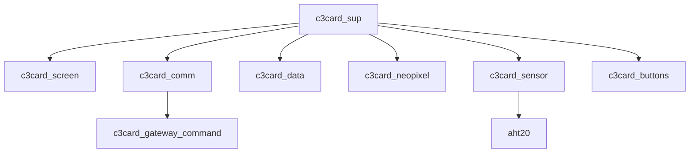

# Workshop

## Requirements

Participants are required to have certain software prerequisites in
place. Please review and ensure the folowing requirements are met
before starting:

  - **esptool.py**: Ensure that `esptool.py` is installed and
    functioning correctly on your system. This tool is essential for
    communicationg with the ESP ROM bootloader. [Installation
    guide](https://docs.espressif.com/projects/esptool/en/latest/esp32/installation.html)

  - **Serial port permissions**: Verify that you have working serial
    port permissions for accessing `/dev/ttyACM0` (or equivalent for
    your system). We need this in order to flash and communicate with
    the development board.

  - **Erlang/OTP**: A working and up-to-date installation of
    Erlang/OTP (26.x) is required. Follow your prefered installation
    instructions.

  - **rebar3**: The latest version of rebar3 must be installed. This
    is the build tool we are going to use for this workshop, and it
    provides the required features for flashing our application to the
    c3card. [Get rebar3](http://rebar3.org/)

And in case you also want to compile your own
[AtomVM](https://atomvm.net) binary, you must also have:

  - **Expressif IDF**: v5.1.x of the IDF-SDK must be installed. Please
    refer to [their download and installation
    instructions](https://docs.espressif.com/projects/esp-idf/en/v5.1.2/esp32/get-started/index.html)

  - **AtomVM**: Latest `master` branch is ok to use. Follow the
    installation instructions at [the AtomVM
    site](https://www.atomvm.net/doc/master/getting-started-guide.html)

## The c3card application

The `c3card` application adheres to a conventional OTP structure but
incorporates a few differences. The primary entry point in AtomVM for
this application is defined by `c3card:start/0`. This function is
invoked following the completion of the device's main booting
procedures.

Upon initialization, the application will try to start a couple of
required facilities such as configuration management, logging
mechanisms and wireless conectivity.

Prior to transition into the main loop via `c3card:start/0`, the
application will start with the following components enabled:

  - `c3card_screen`: Manages the operation for the built-in OLED
    display.

  - `c3card_data`: Facilitates a direct TCP connection to the gateway.

  - `c3card_comm`: Allows for remote command execution from the
    gateway.

  - `c3card_buttons`: Controls the built-in buttons.

  - `c3card_neopixel`: Controls the built-in Neopixel array.

  - `c3card_sensor`: Provides sensor readings from the internal AHT20
    sensor and supports additional `i2c` sensors (given a driver exist
    for such sensor).

Since some of those components share common AtomVM facilities, such
setup is done within `c3card_sup:start_link/0` before provisioning
it's children.

The primary loop within `c3card:start/0` will run continuously and
will execute a couple of tasks. It's main function is to consistently
monitor and compile the device's current status:

  - Internal memory statistics
  - Internal sensor readings
  - Current button status

Once the device status is aggregated, the loop then transmit the
information to the gateway for further analysis and statistics, and
also enables the gateway to connect back to the device for remote
command execution.

> #### Disclaimer {: .neutral}
>
> The internal loop is still a work in progress and it might change
> drastically.

The communication between the `c3card` and the gateway is managed via
Erlang terms, sent as binaries over the wireless interface. Both
`c3card_comm` and `c3card_data` implement this pattern. The commands
that the gateway sends are dispatched to `c3card_gateway_command`
module which implements the `c3card_command` behaviour.

### Supervisor tree

